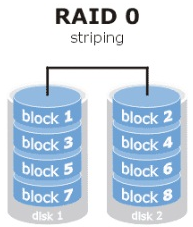
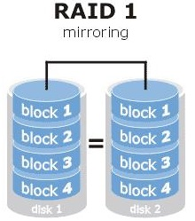
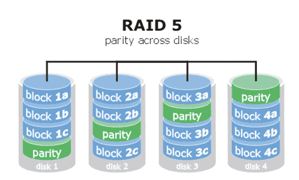
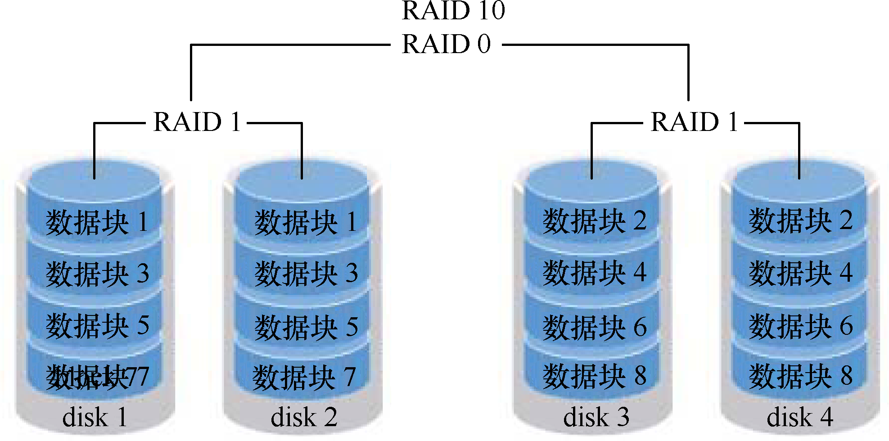

# RAID

### RAID  0



### RAID 1



### RAID 5



### RAID 10




### mdadm命令的常用参数和作用

| 参数 | 作用         |
| -- | ---------- |
| -a | 检测设备名称     |
| -n | 指定设备数量     |
| -l | 指定RAID级别   |
| -C | 创建         |
| -v | 显示过程       |
| -f | 模拟设备损坏     |
| -r | 移除设备       |
| -Q | 查看摘要信息     |
| -D | 查看详细信息     |
| -S | 停止RAID磁盘阵列 |


### RAID 10 案例演示

```
mdadm -Cv /dev/md0 -a yes -n 4 -l 10 /dev/sdb /dev/sdc /dev/sdd /dev/sde

mdadm -Q /dev/md0
mdadm -D /dev/md0

mkfs.xfs /dev/md0

mkdir /haha
mount /dev/md0 /haha/
df -h

vim /etc/fstab
/dev/md0                /haha                   xfs     defaults        0 0
```

```bash
此时拔掉一块硬盘（假设是sdb）

mdadm -D /dev/md0

mdadm /dev/md0 -f /dev/sdb

mdadm -D /dev/md0


umount /haha
mdadm /dev/md0 -a /dev/sdb
mdadm -D /dev/md0

# 同步完成后
mount -a
df -h
cd /haha
ls
```


### RAID 5 案例演示

```bash
mdadm -Cv /dev/md0 -a yes -n 3 -x 1 -l 5 /dev/sdb /dev/sdc /dev/sdd /dev/sde

# -x  热备盘
```


### 硬件RAID查看

#### 查看硬件是否支持RAID

```bash
lspci | grep -i raid
```

#### 查看系统是否支持RAID

```bash
dmesg | grep -i raid
```

#### 查看RAID信息

```bash
cat /proc/scsi/scsi
```


### 软RAID查看

```bash
df -hT

# 此处/dev/mapper/centos-root为 df -hT 命令返回结果中的一项
mdadm -D /dev/mapper/centos-root

cat /proc/mdstat
```
