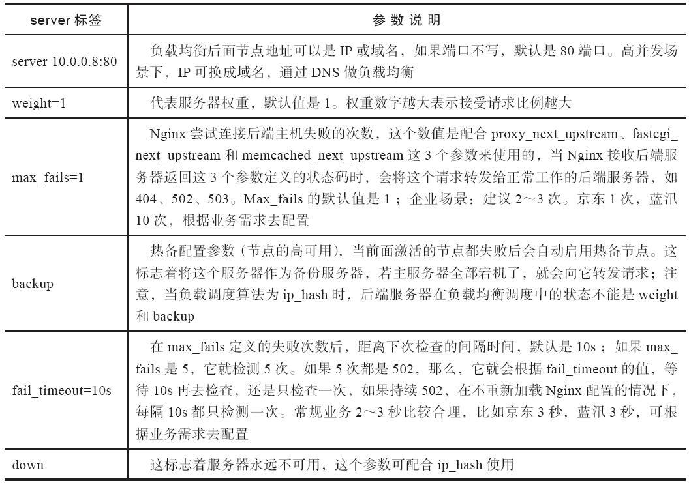

# 负载均衡-1

### nginx反向代理配置概览

```
cat /etc/nginx/nginx.conf
```

```
worker_processes  1;
events {
    worker_connections  1024;
}

http {
    include       mime.types;
    default_type  application/octet-stream;
    sendfile        on;
    keepalive_timeout  65;
    
    upstream www_pools {
        server 192.168.1.17:80 weight=1;
        server 192.168.1.18:80 weight=1;
    }
    
    server {
        listen       80;
        server_name  www.will.com;
        location / {
            proxy_pass http://www_pools;
            proxy_set_header Host $host;
            proxy_set_header X-Forwarded-For $remote_addr;
        }
    }
}
```

### server标签常用参数说明




### 常用算法

| 静态算法     | 说明                                 |
| -------- | ---------------------------------- |
| rr       | 默认调度算法                             |
| wrr      | 权重轮询                               |
| ip\_hash | 同一个ip调度给同一个节点（不能写入weight和backup参数） |

| 动态算法        | 说明                                                        |
| ----------- | --------------------------------------------------------- |
| fair        | 按响应速度调度（需安装upstream\_fair模块）                              |
| least\_conn | 按最少连接调度                                                   |
| url\_hash   | 同一个url地址调度给同一台节点（不能写入weight参数，需安装hash模块，常用于web缓存服务器的负载均衡） |
| 一致性hash算法   |                                                           |


\***面试题**\*

> 300T 的数据缓存怎么做？
>
> url\_hash算法


### 一键安装配置nginx反向代理脚本

#### 所需服务器列表

| 服务器ip        | 主机名   | 用途                      |
| ------------ | ----- | ----------------------- |
| 192.168.1.15 | lb01  | nginx 负载均衡 （此实验中需要进行配置） |
| 192.168.1.17 | web01 | nginx web （假设已提前配置好）    |
| 192.168.1.18 | web02 | nginx web （假设已提前配置好）    |
| 192.168.1.61 | m01   | 管理机，局域网本地yum源（假设已提前配置好） |

#### onekey\_install\_nginx\_proxy.sh

> 此脚本执行于 **lb01** 上

```
#!/bin/bash

# configure local yum repo
cat > /etc/yum.repos.d/yum_local.repo << EOF
[yum_local]
name=yum_local
baseurl=http://192.168.1.61
gpgcheck=0
enabled=1
EOF

yum clean all
yum makecache

# install nginx
yum install nginx -y


# configure nginx
mv /etc/nginx/nginx.conf{,.backup}


cat > /etc/nginx/nginx.conf << EOF
worker_processes  1;
events {
    worker_connections  1024;
}

http {
    include       mime.types;
    default_type  application/octet-stream;
    sendfile        on;
    keepalive_timeout  65;
    
    upstream www_pools {
        server 192.168.1.17:80 weight=1;
        server 192.168.1.18:80 weight=1;
    }
    
    server {
        listen       80;
        server_name  www.will.com;
        location / {
            proxy_pass http://www_pools;
            proxy_set_header Host \$host;
            proxy_set_header X-Forwarded-For \$remote_addr;
        }
    }
}
EOF


# start nginx
systemctl start nginx
systemctl enable nginx
```

