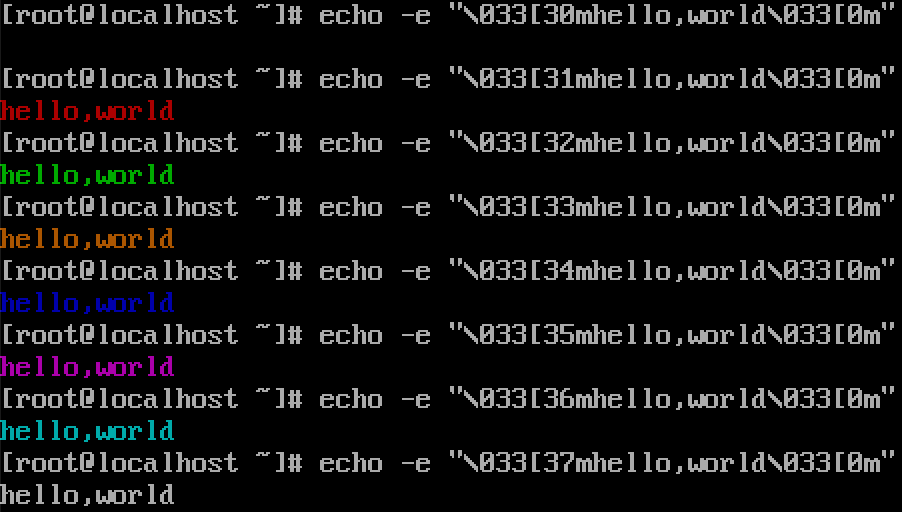

# shell 颜色显示

### 颜色编码

|    | 文字颜色 | 背景色 |   |   |        | 显示方式 |
| -- | ---- | --- | - | - | ------ | ---- |
| 黑  | 30   | 40  |   |   | 终端默认设置 | 0    |
| 红  | 31   | 41  |   |   | 高亮显示   | 1    |
| 绿  | 32   | 42  |   |   | 下划线    | 4    |
| 棕  | 33   | 43  |   |   | 闪烁     | 5    |
| 蓝  | 34   | 44  |   |   | 反白显示   | 7    |
| 紫红 | 35   | 45  |   |   | 隐藏     | 8    |
| 青  | 36   | 46  |   |   |        |      |
| 白  | 37   | 47  |   |   |        |      |


更多信息可查看帮助手册 ( CentOS6 )：**man console\_codes**


### 示例

```
echo -e "\033[文字颜色;背景颜色;显示方式m字符串\033[0m"

echo -e "\E[文字颜色;背景颜色;显示方式m字符串\E[0m"


\033 等同于 \E

文字颜色 背景颜色 显示方式 可指定某一项单独使用
```

```
echo -e "\033[34;42;5mhello, world\033[0m"
```




#### man手册

```
       param   result
       0       reset all attributes to their defaults
       1       set bold
       2       set half-bright (simulated with color on a color display)
       4       set  underscore (simulated with color on a color display)
               (the colors used to simulate dim  or  underline  are  set
               using ESC ] ...)
       5       set blink
       7       set reverse video
       10      reset  selected mapping, display control flag, and toggle
               meta flag (ECMA-48 says "primary font").
       11      select null mapping, set display control flag, reset tog‐
               gle meta flag (ECMA-48 says "first alternate font").
       12      select null mapping, set display control flag, set toggle
               meta flag (ECMA-48 says "second  alternate  font").   The
               toggle meta flag causes the high bit of a byte to be tog‐
               gled before the mapping table translation is done.
       21      set normal intensity (ECMA-48 says "doubly underlined")
       22      set normal intensity
       24      underline off
       25      blink off
       27      reverse video off
       30      set black foreground
       31      set red foreground
       32      set green foreground
       33      set brown foreground
       34      set blue foreground
       35      set magenta foreground
       36      set cyan foreground
       37      set white foreground
       38      set underscore on, set default foreground color
       39      set underscore off, set default foreground color
       40      set black background
       41      set red background
       42      set green background
       43      set brown background
       44      set blue background
       45      set magenta background
       46      set cyan background
       47      set white background
       49      set default background color
```

#### shell实现

```sh
#!/bin/bash

#-------- color --------
if [ -t 1 ]; then # is terminal?
    RED="\E[0;31m"
    RED_BOLD="\E[1;31m"
    GREEN="\E[0;32m"
    GREEN_BOLD="\E[1;32m"
    BROWN="\E[0;33m"
    BROWN_BOLD="\E[1;33m"
    BLUE="\E[0;34m"
    BLUE_BOLD="\E[1;34m"
    MAGENTA="\E[0;35m"
    MAGENTA_BOLD="\E[1;35m"
    CYAN="\E[0;36m"
    CYAN_BOLD="\E[1;36m"
    WHITE="\E[0;37m"
    WHITE_BOLD="\E[1;37m"
    RESET="\E[0m"
fi

echo -e "${RED}Hello${RESET}"
echo -e "${RED_BOLD}Hello${RESET}"
echo -e "${GREEN}Hello${RESET}"
echo -e "${GREEN_BOLD}Hello${RESET}"
echo -e "${BROWN}Hello${RESET}"
echo -e "${BROWN_BOLD}Hello${RESET}"
echo -e "${BLUE}Hello${RESET}"
echo -e "${BLUE_BOLD}Hello${RESET}"
echo -e "${MAGENTA}Hello${RESET}"
echo -e "${MAGENTA_BOLD}Hello${RESET}"
echo -e "${CYAN}Hello${RESET}"
echo -e "${CYAN_BOLD}Hello${RESET}"
echo -e "${WHITE}Hello${RESET}"
echo -e "${WHITE_BOLD}Hello${RESET}"
```

<figure><figcaption></figcaption></figure>
