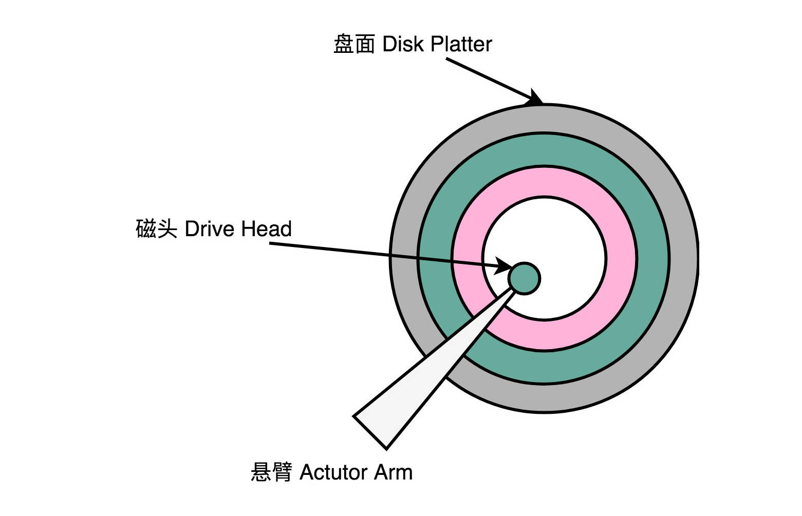

# Disk Partition & Mount

.png>)

.png>)

### 名词解释

| Name     | 中文翻译         |
| -------- | ------------ |
| Disk     | 磁盘           |
| Head     | 磁头           |
| Sector   | 扇区           |
| Track    | 磁道           |
| Cylinder | 柱面           |
| Units    | 单元块（一个柱面的大小） |
| Block    | 数据块          |
| Inode    | 索引节点         |

### 主引导扇区

硬盘的第一个扇区被保留为主引导扇区，它位于整个硬盘的**0磁头0柱面1扇区**（Head 0, Cylinder 0, Sector 1），包括硬盘**主引导记录MBR**(Main Boot Record)和**分区表DPT**(Disk Partition Table)。

| Name | Description       |
| ---- | ----------------- |
| MBR  | 446字节（0000--01BD) |
| DPT  | 64字节（01BE--01FD）  |
| 结束标志 | 2字节（55 AA)        |

DPT总共64字节，描述一个分区的相关内容项占16个字节，故只能容纳4个分区。
